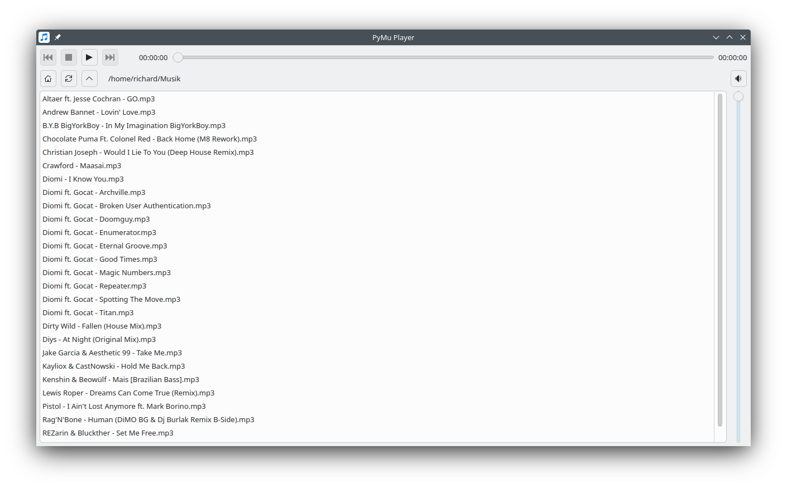

  

<h1 align="center">PyMu Player</h1>

<h2 align="center">A Simple Music Player for GNU/Linux, Windows, macOS & *BSD</h2>

 

Browse your files, play your music. No need to import tracks or playlists. Listen to your music, fast and easy.

Written in Python, using QtMediaPlayer.

- - -

### Run

`python3 PyMuPlayer.py`

- - -

### Requirements

- [Python 3](https://www.python.org/downloads/)
- [PyQt6](https://pypi.org/project/PyQt6/)
- [PyQt6-QtMultimedia](https://pypi.org/project/PyQt6/)

 

**Example:**

Ubuntu:
`sudo apt install python3 python3-pyqt6 python3-pyqt6.qtmultimedia`

---

### About

Copyright (c) 2025 Richard Knausenberger

---

### License
This project is licensed under the **GNU GPL v3** - see the [LICENSE](LICENSE) file for details.
