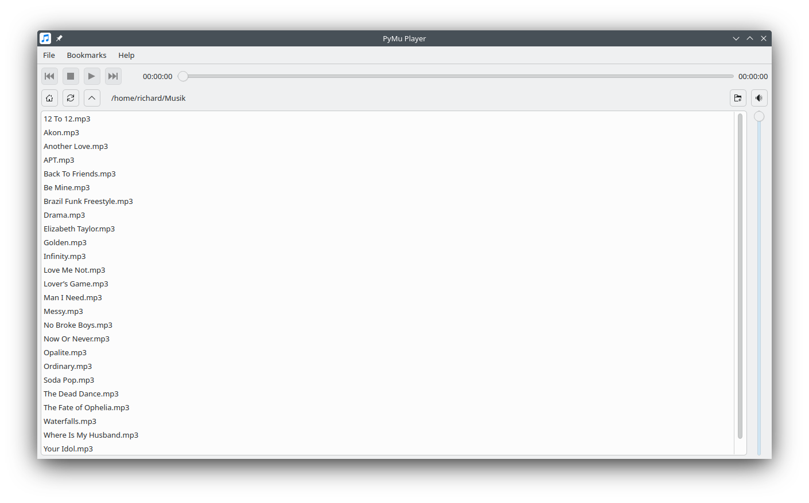

  

<h1 align="center">PyMu Player</h1>

<h2 align="center">A simple music player for GNU/Linux, Windows, macOS & *BSD</h2>

 

Browse your files, play your music. No need to import tracks or playlists. Listen to your music, fast and easy.

Written in Python, using QtMediaPlayer.

 

**Supported file formats:** .mp3, .wav, .ogg, .aac, .aif, .aiff & .flac

*Note: This depends on the codecs installed on your system.*

- - -

### Features

- Browse your files like with a file manager
- Save folders as bookmarks for quick access
- Fully controllable with keyboard shortcuts
- Optional pause between songs
- Available in English and German

- - -

### Run

`python3 PyMuPlayer.py`

- - -

### Requirements

- [Python 3](https://www.python.org/downloads/)
- [PyQt6](https://pypi.org/project/PyQt6/)
- [PyQt6-QtMultimedia](https://pypi.org/project/PyQt6/)

 

**Example:**

Ubuntu:
`sudo apt install python3 python3-pyqt6 python3-pyqt6.qtmultimedia`

---

### About

Copyright (c) 2026 Richard Knausenberger

---

### License

This project is licensed under the **GNU GPL v3**. See [LICENSE](LICENSE) for details.
